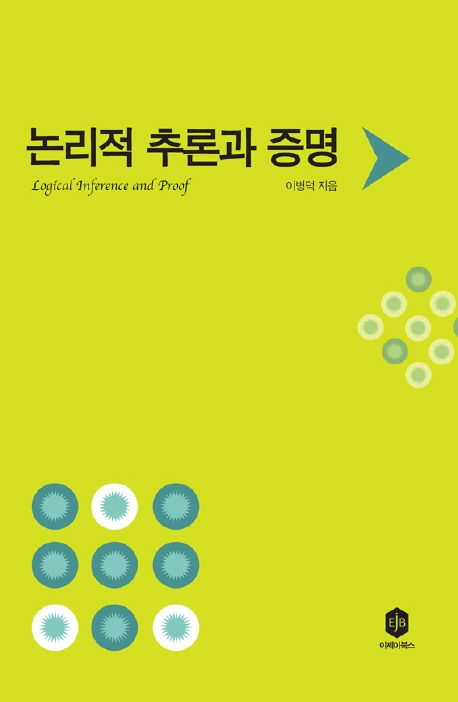

# 논리학 공부

공부목적: 코딩을 하는데 필요한 논리사고력을 함양하기 위함

공부기간: 2020.07 ~ 2020.12

교재: 논리적 추론과 증명(이병덕 지음)

공부방법: 교재에 있는 연습문제를 컴퓨터 워드에 옮겨서 풀이

주요 공부내용: 문장논리, 술어논리, 양화문장

# 예시
아래의 전제들에서 ~A가 도출되는가

전제1: A → B

전제2: B → C

전제3: ~C

## 전제 분석

전제1: A이면 B이다 (조건문)

전제2: B이면 C이다 (조건문)

전제3: ~C가 아니다 (부정문)

## 논리 전개
<table>
  <tr>
    <th>연번</th>
    <th>식</th>
    <th>설명</th>
  </tr>
  <tr>
    <td>1</td>
    <td>A → B</td>
    <td>전제1</td>
  </tr>
  <tr>
    <td>2</td>
    <td>B → C</td>
    <td>전제2</td>
  </tr>
  <tr>
    <td>3</td>
    <td>~C</td>
    <td>전제3</td>
  </tr>
  <tr>
    <td>4</td>
    <td>A</td>
    <td>가정</td>
  </tr>
  <tr>
    <td>5</td>
    <td>B</td>
    <td>1, 4  → 제거 // "A이면 B이다"와 "A이다"라는 정보가 있으면 B를 도출할 수 있다.</td>
  </tr>
  <tr>
    <td>6</td>
    <td>C</td>
    <td>2, 5  → 제거 // "B이면 C이다"와 "B이다"라는 정보가 있으면 C를 도출할 수 있다.</td>
  </tr>
  <tr>
    <td>7</td>
    <td>C</td>
    <td>3, 6 모순 // "~C이다"와 "C이다"는 모순을 일으킨다.</td>
  </tr>
  <tr>
    <td>8</td>
    <td>~A</td>
    <td>4, 5  ~ 도입 // 모순의 원인이 되는 가정을 부정함으로써 ~A가 도출된다.</td>
  </tr>
</table>

